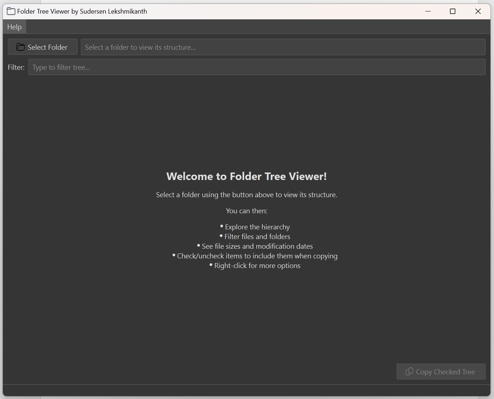
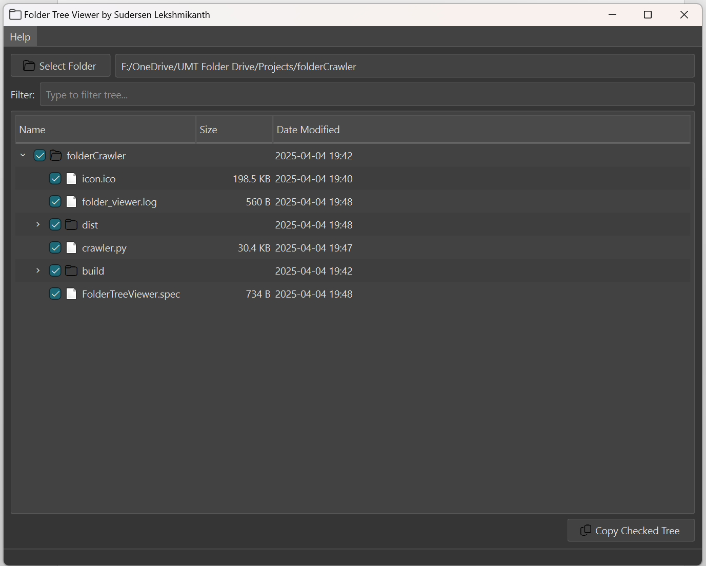

# ✨ Folder Structure Viewer ✨

<p align="center">
  <a href="https://www.python.org/downloads/">
    
  </a>
<a href="https://creativecommons.org/licenses/by-nc/4.0/">
   
 </a>
</p>


**Developed by:** Sudersen Lekshmikanth

> Explore, filter, and manage your directories like never before with this interactive desktop application built using **Python** and the powerful **PySide6 (Qt)** framework!

---

## 🖼️ Sneak Peek




---

## 🚀 Features

- 🌳 **Interactive Tree View**  
  Clear, expandable/collapsible folder hierarchy.

- 👋 **Welcome Screen**  
  Helpful guidance on first launch.

- 📂 **Easy Folder Selection**  
  Native dialog to pick your starting directory.

- 🔍 **Live Filtering**  
  Instantly search and filter the tree by name.

- 📊 **Detailed Columns**  
  View Name, Size (human-readable), and Date Modified. Sortable by clicking headers!

- ✔️ **Checkbox Selection**  
  Selectively include/exclude items for copy operations. Parent state affects children.

- 📋 **Formatted Copy**  
  Copy the checked tree structure with proper indentation and tree lines (`├─`, `└─`, `│ `) – perfect for notes or docs!

- 🖱️ **Context Menu**  
  Right-click for quick actions:  
  _Show in Explorer_, _Open File_, _Copy Path_.

- ℹ️ **Tooltips**  
  Hover over items for their full path.

- 🎨 **Modern Styling**  
  Includes a customizable dark theme using QSS.

- 🧭 **Menu Bar**  
  Access "About" (with credits) and "Support" links easily.

- ⚠️ **Error Handling**  
  User-friendly messages for permission or scan errors.

- 📝 **Logging**  
  Records activity and errors to `folder_viewer.log`.

- 👀 **High-DPI Aware**  
  Optimized for modern display scaling.

---

## 📋 Prerequisites

- Python 3.8+
- Pip
- Dependencies:
  - `PySide6`

---

## ▶️ Running the Application

```bash
python crawler.py
```

<h2>🌱 Future Enhancements</h2>

<ul>
    <li>⚙️ Advanced Context Menu Actions (Rename, Delete, Properties with confirmations).</li>
    <li>⚙️ Drag and Drop support (for reordering or adding external items).</li>
    <li>⚙️ Background scanning thread for large directories (using QThread for UI responsiveness).</li>
    <li>⚙️ Export tree structure to other formats (JSON, CSV, XML).</li>
    <li>⚙️ User-selectable themes / UI appearance customization options.</li>
    <li>⚙️ File preview panel (for images, text files, etc.).</li>
    <li>⚙️ Tabbed interface to manage multiple folder views.</li>
    <li>⚙️ Progress indicator for long scans or operations.</li>
</ul>

☕ Support My Cybersecurity Learning Journey
<p align="center"> <a href="https://buymeacoffee.com/sudersen" target="_blank">  </a> </p>

📬 Let's Connect
🔗 LinkedIn – www.linkedin.com/in/drsudersen

